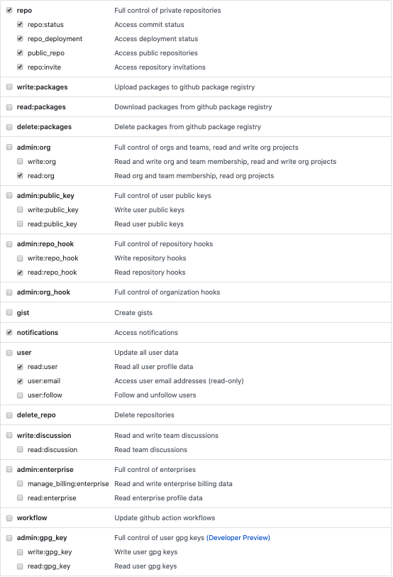

#  gitRank

### Tracking PRs has never been so easy

If a Slack message like _"Can anyone review this PR, please?"_ sound familiar to you, this might interest you, so keep reading!​ :sassy_woman:

GitHub offers a view of all the PRs that belong to any of your organizations and their status . However, the reality of many teams is that working with many different repositories and with a different set of rules of process can make this page too crowded to follow!

Something as simple as favoriting top priority pull requests is one click away from you with gitRank :tada:

### What's the point of gitRank?

To make it easier for users to see precisely what is going on with they and their team's pull requests before they are merged or closed.

### Why should _I_ care?

In my opinion, **there's no community more collaborative than the software community**. In the corporate environment, very frequently this collaboration exists too. No matter if you are part of the open-source community, or part of a private organization, there's something that we **all** have in common. That is to deliver purposeful software.

By helping collaborators, you're getting one step closer to your ultimate goal.

### Usage

#### First steps

1. Visit https://gitrank.dev/
2. Type in your username
3. Copy paste your Github token
4. (optional) Github enterprise? We have a solution for you too. Paste your company's graphql endpoint
5. Happy coding! :woman_technologist: :purple_heart:

#### GitHub token

If it's unclear to you how to generate your github token follow the instructions [here](https://help.github.com/en/github/authenticating-to-github/creating-a-personal-access-token-for-the-command-line)

Gitrank will only need read permissions to access your PRs, **we will not modify or create**

`Disclaimer:` GitRank does not store your token, username or PR information.

#### Screenshots

### Tech Stack

React

### Features

1. GitHub enterprise compatibility
2. Copy PR link to clipboard
3. Click on title to direct access to repository/PR
4. Filter by organization/repository
5. Favorite PRs

### Roadmap

... it had to be here :kissing_smiling_eyes:

| Prio | Feature                               | Customer-facing?   |
| ---- | ------------------------------------- | ------------------ |
| P1   | Infinite scroll                       | :white_check_mark: |
| P1   | Toggle Filter bar                     | :white_check_mark: |
| P1   | Download to Desktop                   | :white_check_mark: |
| P2   | App Performance Monitoring            | :stop_sign:        |
| P2   | Github OAuth                          | :white_check_mark: |
| P2   | User custom settings                  | :white_check_mark: |
| P2   | Add custom view to URL (link sharing) | :white_check_mark: |
| P3   | Slack integration                     | :white_check_mark: |

### Contribute

`CONTRIBUTE.md` coming soon!

Meanwhile, fork the repo and send me a PR :boom: 

### Suggest a feature!

Many options:

-   Open an issue :spiral_notepad:
-   Find me on Twitter 
-   Find me on [LinkedIn](https://www.linkedin.com/in/martacolombas/)
